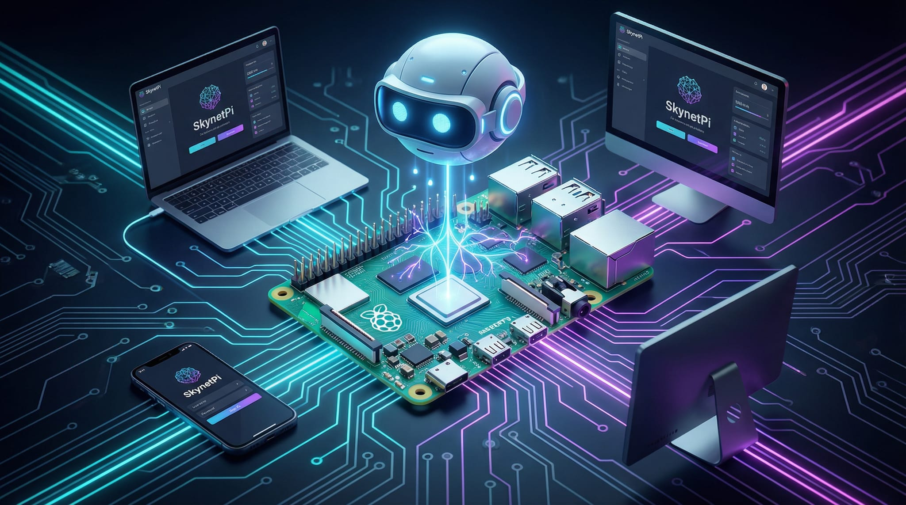

<div align="center">



# 🤖 SkynetPi

### Your Personal AI That Can See and Control Any Screen

*Transform a $60 Raspberry Pi into an autonomous AI agent capable of operating any computer, phone, or device — just like a human would.*

[](LICENSE)
[](https://idiogo.gumroad.com/l/skynetpi)
[]()
[]()

[Features](#-features) • [How It Works](#-how-it-works) • [Quick Start](#-quick-start) • [Use Cases](#-use-cases) • [Hardware](#-hardware)

</div>

---

## 🎯 The Problem

You want AI to help you with tasks on your computer. But current solutions require:

- ❌ Installing software on the target machine
- ❌ Admin/root access
- ❌ Bypassing security policies
- ❌ Complex API integrations
- ❌ The target system to "support" automation

**What if AI could just... use a computer like you do?**

Plug in a monitor. Plug in a keyboard and mouse. Look at the screen. Click things. Type things. Done.

---

## ✨ The Solution

**SkynetPi is an AI that operates devices the way humans do — through the screen, keyboard, and mouse.**

```
┌─────────────────────────────────────────────────────────────────────┐
│                                                                     │
│   👤 Human Way                    🤖 SkynetPi Way                   │
│                                                                     │
│   Eyes → Screen                   HDMI Capture → Screen             │
│   Hands → Keyboard/Mouse          USB HID → Keyboard/Mouse          │
│   Brain → Decisions               Claude AI → Decisions             │
│                                                                     │
│   Same interface. No installation. No admin access needed.          │
│                                                                     │
└─────────────────────────────────────────────────────────────────────┘
```

---

## 🚀 Features

### 🔌 Zero Installation on Target
Plug in cables. That's it. Works on any device with HDMI output and USB input.

### 🔒 Bypasses Software Restrictions
No admin rights? Corporate lockdown? Air-gapped system? Doesn't matter — we use the same interface humans use.

### 🧠 AI-Powered Decision Making
Claude AI analyzes the screen and decides what to do next, just like you would.

### 👁️ Visual Feedback Loop
Doesn't blindly click coordinates. Looks at the screen, finds the cursor, moves toward the target, verifies, then acts.

### 💬 Natural Language Tasks
Tell it what to do in plain language: *"Open Chrome and search for weather in São Paulo"*

### 📱 Works on Everything
- Computers (Mac, Windows, Linux)
- Phones (iPhone, Android with adapters)
- Kiosks, ATMs, legacy systems
- Anything with a screen and input

---

## 🔄 How It Works

### Architecture Overview

```
┌──────────────────────────────────────────────────────────────────────────┐
│                            YOUR RASPBERRY PI                             │
│  ┌────────────────────────────────────────────────────────────────────┐  │
│  │                                                                    │  │
│  │   ┌─────────────┐    ┌─────────────┐    ┌─────────────────────┐   │  │
│  │   │   OpenClaw  │───▶│  SkynetPi   │───▶│   Claude Vision     │   │  │
│  │   │   Gateway   │    │   Agent     │    │   (Cloud API)       │   │  │
│  │   └─────────────┘    └──────┬──────┘    └─────────────────────┘   │  │
│  │         │                   │                      │              │  │
│  │         │            ┌──────┴──────┐               │              │  │
│  │         │            │             │               │              │  │
│  │         ▼            ▼             ▼               │              │  │
│  │   ┌──────────┐  ┌─────────┐  ┌─────────┐          │              │  │
│  │   │ Message  │  │  HDMI   │  │   USB   │          │              │  │
│  │   │ Channel  │  │ Capture │  │   HID   │◀─────────┘              │  │
│  │   └──────────┘  └────┬────┘  └────┬────┘                         │  │
│  │                      │            │                               │  │
│  └──────────────────────┼────────────┼───────────────────────────────┘  │
│                         │            │                                   │
└─────────────────────────┼────────────┼───────────────────────────────────┘
                          │            │
                    ┌─────┴────────────┴─────┐
                    │                        │
                    │    TARGET DEVICE       │
                    │    (Any computer,      │
                    │     phone, etc.)       │
                    │                        │
                    │  No software needed!   │
                    │                        │
                    └────────────────────────┘
```

### The Visual Feedback Loop

Unlike traditional automation that blindly executes coordinates, SkynetPi **sees and adapts**:

```
                    ┌──────────────────────────────────────┐
                    │                                      │
                    ▼                                      │
            ┌───────────────┐                              │
            │   📸 Capture  │                              │
            │    Screen     │                              │
            └───────┬───────┘                              │
                    │                                      │
                    ▼                                      │
            ┌───────────────┐                              │
            │   🧠 Analyze  │                              │
            │  with Claude  │                              │
            │               │                              │
            │ • Find cursor │                              │
            │ • Find target │                              │
            │ • Plan action │                              │
            └───────┬───────┘                              │
                    │                                      │
                    ▼                                      │
            ┌───────────────┐                              │
            │   🎯 Execute  │                              │
            │    Action     │                              │
            │               │                              │
            │ • Move mouse  │                              │
            │ • Click       │                              │
            │ • Type        │                              │
            └───────┬───────┘                              │
                    │                                      │
                    ▼                                      │
            ┌───────────────┐      No ┌────────────────┐  │
            │   ✅ Done?    │─────────│ Keep going     │──┘
            └───────┬───────┘         └────────────────┘
                    │ Yes
                    ▼
            ┌───────────────┐
            │   🎉 Task     │
            │   Complete    │
            └───────────────┘
```

### Communication Flow

```
┌─────────┐         ┌─────────┐         ┌─────────┐         ┌─────────┐
│   You   │         │ Message │         │SkynetPi │         │ Target  │
│         │         │ Channel │         │   Pi    │         │ Device  │
└────┬────┘         └────┬────┘         └────┬────┘         └────┬────┘
     │                   │                   │                   │
     │  "Click Settings" │                   │                   │
     │──────────────────▶│                   │                   │
     │                   │   Task received   │                   │
     │                   │──────────────────▶│                   │
     │                   │                   │   Capture screen  │
     │                   │                   │──────────────────▶│
     │                   │                   │   Screen image    │
     │                   │                   │◀──────────────────│
     │                   │                   │                   │
     │                   │                   │──┐ Analyze with   │
     │                   │                   │  │ Claude Vision  │
     │                   │                   │◀─┘                │
     │                   │                   │                   │
     │                   │                   │   Move mouse      │
     │                   │                   │──────────────────▶│
     │                   │                   │   Click           │
     │                   │                   │──────────────────▶│
     │                   │                   │                   │
     │                   │   "Done! ✅"      │                   │
     │                   │◀──────────────────│                   │
     │   "Done! ✅"      │                   │                   │
     │◀──────────────────│                   │                   │
     │                   │                   │                   │
```

---

## 💡 Use Cases

### 🏢 Enterprise & IT

| Use Case | Description |
|----------|-------------|
| **Legacy System Automation** | Automate old systems that have no API |
| **RPA Without Installation** | Robotic Process Automation on locked-down machines |
| **Kiosk Management** | Control and monitor unattended displays |
| **Multi-Platform Testing** | Test applications across different OS without VMs |

### 🏠 Personal

| Use Case | Description |
|----------|-------------|
| **Smart Home Hub** | Control any device with a screen |
| **Accessibility** | Voice-controlled computer operation |
| **Remote Assistance** | Help family/friends with their computers |
| **Automation** | Automate repetitive tasks on any device |

### 🔬 Research & Development

| Use Case | Description |
|----------|-------------|
| **AI Agent Research** | Study autonomous agent behavior |
| **HCI Studies** | Human-Computer Interaction research |
| **Security Testing** | Test physical access scenarios |

---

## 📦 Quick Start

### 🎬 Video Walkthrough

<div align="center">

[](https://youtu.be/pF1PJI_awSQ)

*▶️ Watch: Full installation guide — from unboxing to first command*

</div>

### Prerequisites

- Raspberry Pi 5 (4GB+ recommended)
- microSD card (32GB+) with Raspberry Pi OS
- Internet connection
- An LLM API key (see model recommendations below)

### Model Recommendations

In our testing, **Claude Opus** (by Anthropic) delivers the best performance for SkynetPi — especially for vision-based device control, complex reasoning, and agentic tasks. We recommend starting with it.

That said, OpenClaw supports multiple model providers (Anthropic, OpenAI, Google, and others). Feel free to experiment with different providers and models to find what works best for your use case and budget. You can change the model at any time in your OpenClaw configuration.

### One-Command Install

```bash
curl -sL https://raw.githubusercontent.com/idiogo/skynetpi-bootstrap/main/install.sh | bash
```

The installer will ask for:
1. 🤖 Bot name
2. 👤 Your name  
3. 📱 Whether to set up a message channel now (WhatsApp/Telegram) or use the built-in web chat — you can always add a channel later
4. 🔑 API key for your LLM provider
5. 🌍 Timezone

### After Installation

```bash
# Link your messaging channel (e.g., WhatsApp, Telegram, Slack)
openclaw whatsapp link    # For WhatsApp (scan QR code)
# Or configure Telegram/Slack — see OpenClaw docs for other channels

# Check status
openclaw status

# View logs
openclaw gateway logs
```

### Send Your First Command

Open your messaging channel (WhatsApp, Telegram, Slack, etc.) and message your bot:

> "Hello! What can you do?"

---

## 🔧 Hardware

### Basic Setup (AI Assistant Only)

Just the Pi — chat via your preferred channel (WhatsApp, Telegram, Slack, etc.), no device control.

```
┌─────────────┐
│ Raspberry   │◀──── Power + Internet
│ Pi 5        │
└─────────────┘
```

**Cost: ~$60**

### Full Setup (Device Control)

Add HDMI capture + USB cable for full control.

```
                          HDMI Cable
┌─────────────┐         ┌─────────────┐         ┌─────────────┐
│   Target    │────────▶│   Capture   │────────▶│ Raspberry   │
│   Device    │         │    Card     │   USB   │ Pi 5        │
│             │◀────────│             │         │             │
└─────────────┘   USB   └─────────────┘         └─────────────┘
              (Keyboard/Mouse)
```

**Components:**
| Item | Purpose | ~Price |
|------|---------|--------|
| Raspberry Pi 5 (4GB) | Brain | $60 |
| USB-C Data Cable | Keyboard/Mouse output | $10 |
| HDMI Capture Card | See the screen | $15 |
| HDMI Cable | Connect target to capture | $5 |
| **Total** | | **~$90** |

⚠️ **Important:** The USB-C cable must support **data transfer**, not just charging! Test by transferring a file first.

### Optional: Display on Pi

Add a small display to see what the AI sees in real-time.

```bash
pip install opencv-python
python -m ram_kvm_ai.viewer
```

### Optional Modules

These modules are installed separately and are completely optional:

#### 📺 3.5" TFT LCD Display (MHS35)

Install drivers for a 3.5" LCD touchscreen:

```bash
./scripts/install-tft.sh
```

> ⚠️ **Warning:** This will disable HDMI output! The Pi will reboot automatically.
> To restore HDMI: `cd ~/LCD-show && sudo ./LCD-hdmi`

#### 📊 Status Dashboard

A real-time dashboard showing what the AI is doing (optimized for 480x320 LCD):

```bash
./scripts/install-dashboard.sh
```

Features:
- Shows tool calls, messages, KVM events in real-time
- Auto-starts on boot
- Desktop shortcut for manual launch
- KVM events (keyboard, mouse, screen capture) highlighted in orange

#### 🎮 USB HID Gadget (KVM Control)

Turn your Pi into a USB keyboard/mouse to control other devices:

```bash
./scripts/install-hid.sh
```

After reboot:
- Connect Pi's USB-C port to target device (Mac, iPhone, PC)
- Pi appears as a keyboard + mouse
- Use `hid-control.py` to send keystrokes and mouse movements

```bash
# Examples
./scripts/hid-control.py type "Hello World"
./scripts/hid-control.py spotlight  # Cmd+Space on Mac
./scripts/hid-control.py click
./scripts/hid-control.py move 50 -30
```

> **Tip:** For iPhone, enable AssistiveTouch (Settings > Accessibility > Touch)

#### 📹 HDMI Capture

To see what's on the target device's screen, you need an HDMI capture card:

**Recommended:** MACROSILICON USB 3.0 HDMI Capture (~$15-30)

```bash
# Check if capture card is detected
v4l2-ctl --list-devices

# Capture a frame
ffmpeg -f v4l2 -video_size 1920x1080 -i /dev/video0 -frames:v 1 screen.jpg
```

For iPhone/iPad HDMI output, you'll need a Lightning/USB-C to HDMI adapter.

---

## 🔄 Updating

```bash
# Update OpenClaw
sudo npm update -g openclaw

# Update RAM KVM AI
cd ~/ram-kvm-ai && git pull

# Update bootstrap configs (keeps personal files)
cd ~/skynetpi-bootstrap && git pull
./scripts/update-config.sh
```

## 📖 Documentation

- [Hardware Setup Guide](hardware/README.md)
- [RAM KVM AI (Device Control)](https://github.com/idiogo/ram-kvm-ai)
- [OpenClaw Documentation](https://docs.openclaw.ai)

---

## ⚖️ Legal & Ethical Disclaimer

<div align="center">

### ⚠️ IMPORTANT: READ BEFORE USING ⚠️

</div>

This software is provided for **legitimate purposes only**, including:

- ✅ Personal automation and productivity
- ✅ Accessibility assistance
- ✅ Scientific research
- ✅ Educational purposes
- ✅ Commercial applications with proper authorization
- ✅ IT administration of systems you own or have permission to access

**This software must NOT be used for:**

- ❌ Unauthorized access to systems
- ❌ Any illegal activities
- ❌ Bypassing security without authorization
- ❌ Surveillance without consent
- ❌ Any activity that violates local, state, or federal laws

**The user assumes full responsibility** for ensuring their use of this software complies with all applicable laws and regulations. The developers and contributors are not responsible for any misuse of this software.

By using SkynetPi, you agree to use it ethically and legally. **When in doubt, get explicit permission.**

---

## 🤝 Contributing

Contributions welcome! Please read our contributing guidelines first.

```bash
# Clone
git clone https://github.com/idiogo/skynetpi-bootstrap.git

# Create branch
git checkout -b feature/your-feature

# Make changes and commit
git commit -m "Add your feature"

# Push and create PR
git push origin feature/your-feature
```

---

## 📄 License

**Dual Licensed:**

| Use Case | License | Cost |
|----------|---------|------|
| Personal, Educational, Open Source | AGPL-3.0 | Free |
| Commercial, Closed-source | [Commercial License](https://idiogo.gumroad.com/l/skynetpi) | $999 |

The AGPL license requires you to publish your source code if you use SkynetPi in a network service. For commercial use without this obligation, purchase a commercial license.

**The commercial license covers the entire SkynetPi project**, including:
- skynetpi-bootstrap (this repo)
- [ram-kvm-ai](https://github.com/idiogo/ram-kvm-ai) (device control engine)

🛒 **Purchase:** [idiogo.gumroad.com/l/skynetpi](https://idiogo.gumroad.com/l/skynetpi)
📧 **Questions:** skynetpi-commercial@idiogo.com.br

---

## 🙏 Credits

Created with 🤖 by [SkynetPi](https://github.com/idiogo/skynetpi-bootstrap) and [Diogo Carneiro](https://github.com/idiogo)

Built on [OpenClaw](https://github.com/openclaw/openclaw) • Powered by [Claude](https://anthropic.com)

---

<div align="center">

**[⬆ Back to top](#-skynetpi)**

*"The best interface is no interface — just plug in and go."*

</div>
